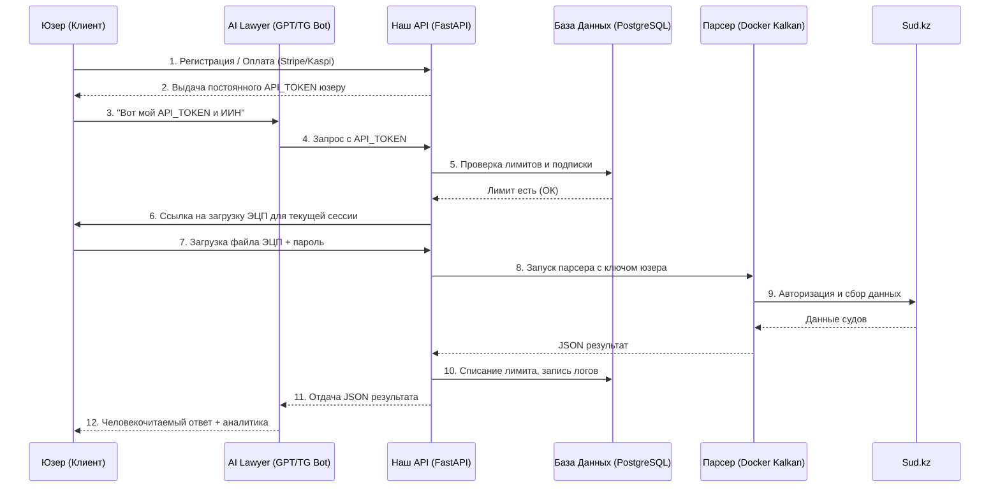

# Архитектура API-моста для ИИ-платформ и CRM

## Обзор архитектуры
Система представляет собой универсальный шлюз (API), который позволяет ИИ-агентам (ChatGPT Actions, Claude MCP), CRM-системам и Telegram-ботам получать структурированные данные судебных дел с портала `sud.kz`.

```
[Пользователь / ИИ / CRM] 
       │ (HTTP Request / JSON-RPC)
       ▼
[FastAPI API Bridge на VPS (Port 8000)]
       │ (Запуск Playwright / Kalkan Docker)
       ▼
[Портал sud.kz]
```

## Компоненты системы

### 1. API Core (`src/app.py`)
* **Технологии**: FastAPI, Uvicorn, Pydantic.
* **Хост**: VPS `151.244.228.104:8000`.
* **Авторизация**: Заголовок `Authorization: Bearer <API_KEY>`. Мастер-ключ задается переменной окружения `AI_LAWYER_API_KEY` (по умолчанию `kz_lawyer_master_secret_2026`).
* **Эндпоинты**:
  * `GET /health` — проверка работоспособности.
  * `POST /api/v1/cases/search` — поиск дел по ИИН/БИН.

### 2. MCP Server (`src/mcp_server.py`)
* **Технологии**: Python (Stdio).
* **Назначение**: Коннектор для Claude Desktop и Cursor.
* **Инструменты (Tools)**:
  * `search_court_cases` — принимает `iin_or_bin` (12 цифр) и `year`. Транслирует вызов в HTTP-запрос к API Core.

### 3. Схема OpenAPI (`openapi_schema.json`)
* **Назначение**: Импорт в Custom GPT Actions на платформе OpenAI (ChatGPT Store).

## Настройки VPS (151.244.228.104)
* **Директория проекта**: `/root/ai_lawyer`
* **Команда запуска**:
  `nohup python3 -m uvicorn app:app --host 0.0.0.0 --port 8000 > /root/ai_lawyer/logs/api.log 2>&1 &`
* **Логи API**: `/root/ai_lawyer/logs/api.log`

## Безопасная авторизация пользователей через NCALayer

Для работы с личным кабинетом `sud.kz` требуется авторизация по ЭЦП. В целях безопасности мы НЕ просим пользователя загружать файл ЭЦП на сервер.

### Схема работы:
1. **Запрос авторизации**: ChatGPT генерирует уникальную ссылку на наш веб-интерфейс авторизации (например, `https://api.domain.com/auth?user_id=123`).
2. **Локальное подписание**: Веб-страница через WebSocket подключается к запущенному на компьютере пользователя приложению NCALayer (порт 13579).
3. **Получение подписи**: Пользователь выбирает ключ AUTH_RSA, вводит пароль локально в окне NCALayer. Подпись формируется на клиенте и отправляется на наш сервер.
4. **Сохранение сессии**: Сервер проверяет подпись, авторизуется на `sud.kz` от имени пользователя, получает сессионные куки и сохраняет их в защищенную базу данных (Supabase/Redis), привязав к `user_id`.
5. **Работа в ИИ**: ИИ делает запросы в личный кабинет, используя сохраненную сессию, без прямого доступа к файлу ЭЦП.

# Архитектура Production-версии AI Lawyer

В MVP мы использовали простую связку "Загрузка ключа -> Временный токен -> Поиск". Для полноценного продакшена (продаж, аналитики и масштабирования) архитектура должна стать более надежной и позволять трекать каждого юзера.

## Общая схема (Mermaid)



## 1. Авторизация и Учет пользователей (Монетизация)

В продакшене у нас появляется **База Данных** (например, Supabase или PostgreSQL). 

- **Личный кабинет:** Юзер регистрируется на нашем сайте (через Google или Telegram).
- **Покупка тарифа:** Он покупает подписку (например, 10 000 тенге за 100 запросов).
- **Персональный токен:** В личном кабинете он получает свой уникальный `USER_API_TOKEN`.
- **Интеграция с ИИ:** Юзер "скармливает" этот токен нашему боту в Telegram или ChatGPT один раз. Бот запоминает, с каким токеном работает этот юзер.

## 2. Безопасность и ЭЦП

Мы **не храним** ЭЦП пользователей вечно. 
- Каждый раз, когда юзер хочет сделать поиск (или раз в сутки), бот скидывает ему уникальную, сгенерированную под него ссылку: `http://наш-домен.kz/auth?session=123`
- Юзер загружает ключ с телефона или ПК.
- Файл ЭЦП помещается в RAM-диск (оперативную память) сервера, Docker делает запрос на sud.kz, и файл **мгновенно уничтожается**. Никаких следов на жестком диске.

## 3. Логирование и Аналитика (Test Driver)

Чтобы понимать, что происходит в системе и за что мы берем деньги:

- **Логирование запросов:** Каждый вызов API записывается в базу (Какой токен, какой ИИН искали, сколько времени занял парсинг, статус успеха/ошибки).
- **Аналитика OpenAI (LangSmith / PostHog):** Мы подключаем трекинг в промпты. Если бот тупит или не может разобрать JSON от нашего API, мы увидим это в дашборде.
- **Мониторинг парсера:** Если sud.kz ложится или меняет дизайн, наш Docker-воркер сразу кидает нам алерт в админский Telegram-чат (Sentry).

## 4. Как это выглядит для GPT Store vs Telegram

- **Для GPT Store (Custom GPT):** Мы используем OAuth 2.0. Когда юзер жмет кнопку в ChatGPT, его перекидывает на наш сайт, он логинится, и ChatGPT сам получает его токен под капотом. Юзеру даже не нужно ничего копировать руками!
- **Для автономного Telegram-бота:** Бот просит привязать аккаунт командой `/login`. Дальше бот сам работает как автономный агент 24/7.
