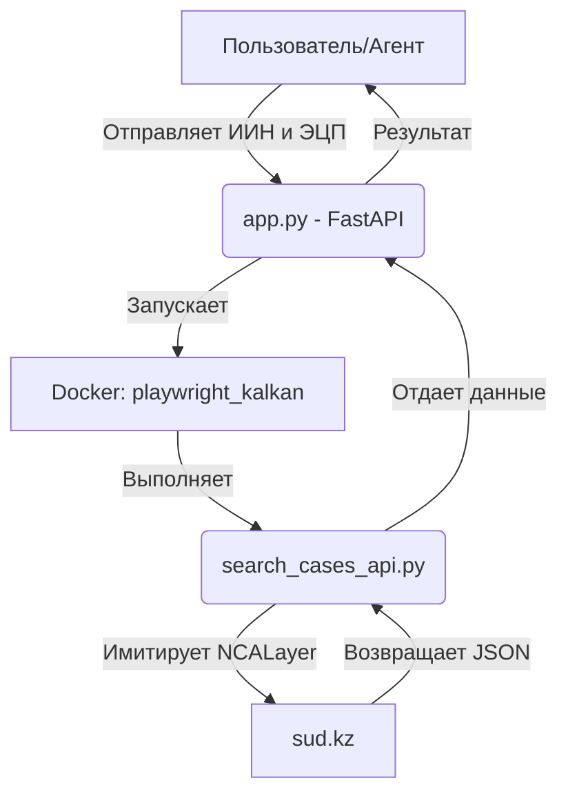

# Техническая Архитектура: AI Lawyer SaaS

Ты задал очень правильные вопросы. Давай разложим всю нашу текущую архитектуру по полочкам, чтобы ты понимал, что у нас уже есть в репозитории (`src/`), как оно работает, и почему я предлагаю именно такой путь дальше.

## 1. Как работает система прямо сейчас (Текущая архитектура)
В папке `src/` у нас уже есть ядро системы. Оно работает так:

1. **`app.py` (FastAPI Bridge):** Это главный API-шлюз на твоем VPS. Он принимает файл ЭЦП (.p12) и пароль, сохраняет их во временную папку.
2. **Docker Container (`playwright_kalkan`):** Как только `app.py` получает запрос на поиск, он поднимает изолированный Docker-контейнер. Внутри этого контейнера запускается `search_cases_api.py`.
3. **`search_cases_api.py`:** Запускает скрытый браузер (Playwright), заходит на sud.kz, подписывает запрос через встроенный эмулятор KalkanCrypt (NCALayer) и вытаскивает список судебных дел.
4. **`mcp_server.py`:** Это мост для ИИ-агентов (как я). Он позволяет ИИ отправлять запросы в `app.py` и получать ответы. Но прямо сейчас он умеет искать дела **только по ИИН/БИН**.

### Диаграмма текущего ядра

---

## 2. Что не так с текущей архитектурой?
1. **Поиск только по ИИН:** Сейчас скрипты заточены под поиск по конкретной компании. А юристам (вроде Николая) нужен поиск по **категориям** (например, "Оспаривание протоколов госзакупок" без привязки к ИИН). Это нужно дописывать в `search_cases_api.py` и `mcp_server.py`.
2. **Нет интерфейса для клиентов:** Чтобы клиент сам запустил поиск, ему нужно как-то отправить файл ЭЦП в `app.py`. Писать для этого полноценный фронтенд (React) или сложного бота на чистом Python с управлением состоянием (state machine) — это долго и дорого.
3. **Где отчеты 24/7?** У нас есть скрипты `tg_notifier.py` и `export_to_drive.py`. Но они работают разрозненно. Они не объединены в единую 24/7 систему мониторинга (Cron-джоб).

---

## 3. Почему Maton (n8n)?
Ты спросил: *"почему матон н8н?? лол."*

Потому что написание сложного Telegram-бота на Python (с кнопками, ожиданием файла ЭЦП, обработкой таймаутов от sud.kz) займет неделю плотного кодинга. А нам нужно протестировать продажи **завтра**.

**Maton.ai (на базе n8n)** — это визуальный конструктор (API-шлюз). 
В нем мы за 2 часа соберем логику:
1. Юрист пишет в ТГ-бота `/start`.
2. n8n ловит сообщение, отправляет юристу меню: "Загрузите ваш ЭЦП".
3. Юрист кидает файл. n8n пересылает этот файл в наш `app.py` на VPS.
4. `app.py` парсит суд.кз (это занимает 5 минут).
5. Пока парсер работает, n8n пишет юристу: "Идет поиск...".
6. Как только VPS отдает JSON, n8n через ноду Gemini (или ChatGPT) анализирует текст решений.
7. n8n формирует Excel-файл и отправляет юристу в Telegram.

Это визуальный SaaS без написания тысяч строк инфраструктурного кода.

---

## 4. Что нужно дописать прямо сейчас (План действий)

Если ты даешь добро, я приступаю к коду. Вот что я изменю в репозитории:

### Шаг 1: Апгрейд парсера и API
- Доработать `src/search_cases_api.py` и `src/app.py` так, чтобы они принимали не только `iin_or_bin`, но и `category` (например, "Госзакупки") + `keywords` (текстовый запрос).

### Шаг 2: Апгрейд MCP-сервера
- Научить `src/mcp_server.py` отдавать ИИ-агенту инструмент `search_by_category`, чтобы я (Antigravity) или LLM в n8n могли запускать глубокий поиск.

### Шаг 3: Скрипт-агрегатор для Excel
- Написать скрипт, который будет брать сырой JSON от `app.py`, прогонять его через LLM-анализ (вытаскивать суть спора) и паковать в красивый `.xlsx` файл.

## Одобрение
Ответь на вопросы, если они остались, и нажми **Proceed**, если одобряешь этот технический апгрейд. Как только нажмешь, я начну модифицировать код парсера для поиска по категориям.
