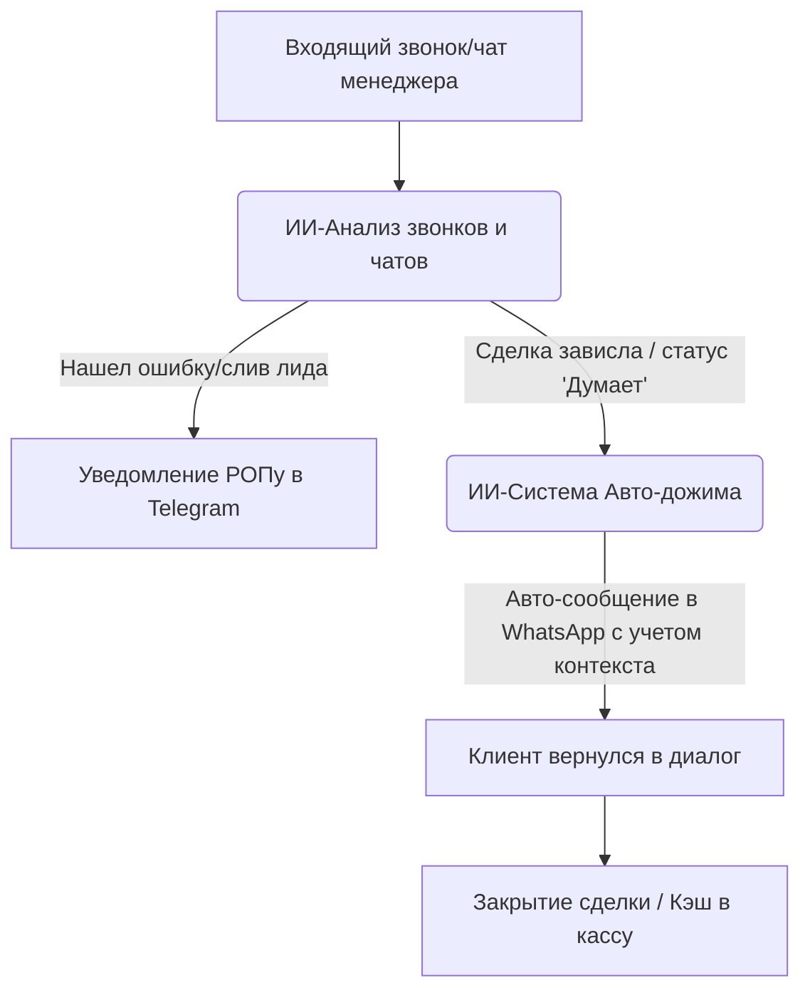

# 🤖 Комплекс: ИИ-Система Продаж (Контроль звонков + Авто-дожим базы)

> **Суть продукта:** Комплексная система продаж на базе искусственного интеллекта, которая закрывает главную дыру в выручке любого B2B/B2C бизнеса: человеческий фактор менеджеров (слив звонков) и брошенные клиенты («я подумаю», «дорого», «купим позже»). 
> *Мы продаем не дешевых "роботов-автоответчиков", а полноценную ИИ-систему продаж.*

---

## 💡 Как работает ИИ-система продаж (Смысл для собственника)



1. **ИИ-Контроль качества (ИИ-ОКК):**
   * Автоматически анализирует 100% звонков и переписок в вашей AmoCRM / Bitrix24.
   * Оценивает менеджеров по вашему чек-листу (выявление потребности, отработка возражений, закрытие на следующий шаг).
   * Выдает РОПу/собственнику ежедневный отчет: кто лучший менеджер, кто сливает лиды и почему.
2. **ИИ-Ассистент дожима (Реаниматор базы в WhatsApp):**
   * Как только ИИ фиксирует, что сделка зависла в статусе «Думает» или менеджер забыл написать клиенту, система запускает авто-дожим.
   * ИИ пишет клиенту в WhatsApp персонально, вспоминая детали прошлого разговора: *«Дмитрий, привет! Вы у нас на прошлой неделе смотрели кухню из массива с каменной столешницей. Определились по размерам или подсказать?»*
   * Реанимирует старую базу клиентов, которые покупали 6-12 месяцев назад.

---

## 🎯 Скрипты захода для HH.ru (Ниша: вакансии менеджеров/КЦ)

> 💡 **Кому пишем:** Компании на HH.ru, у которых открыты вакансии: «Менеджер по продажам», «Оператор колл-центра», «РОП», «Диспетчер».
> **Канал связи:** Отклик на вакансию с сопроводительным письмом или напрямую в WhatsApp/Telegram контакту из вакансии.
> **Цель:** Zoom-встреча на 10–15 минут для показа живого демо. Никакого геморроя с анализом их звонков на старте.

### Вариант 1: Короткий и прямой (Для WhatsApp / Telegram)
```text
Добрый день! Увидел вашу вакансию на менеджера по продажам (оператора КЦ) на HH.

Вы ищете сотрудника, чтобы поднять продажи и разгрузить отдел. Но человек — это оклад, налоги, выгорание и контроль (РОП физически не успевает слушать звонки, а менеджеры забывают дожимать «думающих»).

Мы внедряем ИИ-систему контроля и дожима:
1. Авто-анализ: система читает 100% переписок и звонков в CRM, выявляя, где менеджеры сливают клиентов.
2. Авто-дожим: ИИ сам пишет персональные дожимы клиентам в WhatsApp с учетом контекста прошлого разговора.

Хочу предложить созвониться на 10 минут в Zoom. Покажу на экране живой пример: как ИИ общается, как возвращает зависших клиентов и как это будет выглядеть под вашу нишу. 

Удобно завтра в первой половине дня?
```

### Вариант 2: Сопроводительное письмо на HH.ru (Сразу зовем на Zoom)
```text
Здравствуйте! 

Пишу касательно вашей вакансии «[Название вакансии]». 

При поиске менеджеров главная проблема — это человеческий фактор: сотрудники забывают вовремя перезвонить клиентам со статусом «я подумаю», а РОП успевает прослушать от силы 5% звонков для контроля качества.

Мы помогаем решить это с помощью ИИ-системы продаж:
— Интегрируем ИИ-модуль, который автоматически анализирует 100% звонков в вашей CRM и показывает отчеты по ошибкам менеджеров.
— Внедряем ИИ-ассистентов, которые автоматически дожимают клиентов в WhatsApp персональными сообщениями, возвращая их в диалог.

Предлагаю созвониться на 10 минут в Zoom — я наглядно покажу на экране, как ИИ обрабатывает лидов, как выглядит система авто-дожимов и как ее можно применить конкретно в вашей нише, чтобы поднять конверсию на 12–30%.

С кем из руководства можно согласовать короткий созвон?
```

---

## 👥 Стратегия обхода HR-фильтра (Выход на реального ЛПР)

На HH.ru в 80% случаев на первой линии сидят HR-специалисты (рекрутеры). Их задача — закрыть вакансию человеком, и они будут отсекать любые предложения по автоматизации. 

Чтобы обойти этот фильтр и выйти на РОПа или собственника, используй три стратегии:

### Стратегия 1: «HR как союзник» (Пишем напрямую рекрутеру)
Не пытайся продать систему рекрутеру. Твоя цель — сделать так, чтобы он переслал твое сообщение своему руководителю (РОПу или коммерческому).
```text
Добрый день, [Имя HR]! 

Вижу, вы ищете менеджера по продажам на HH. Понимаю, как сейчас сложно найти и адаптировать сильного продавца.

Мы помогаем руководителям отделов продаж разгрузить команду и поднять конверсию текущих менеджеров с помощью ИИ-системы (автоматический контроль звонков и авто-дожимы клиентов в WhatsApp). Часто это вообще снимает необходимость расширять штат.

Подскажите, пожалуйста, контакты руководителя отдела продаж (или коммерческого директора) — хочу скинуть ему 1-минутное демо-видео, как это работает в вашей нише. Заранее спасибо!
```

### Стратегия 2: «Личный обход» через мессенджеры
Номера телефонов, указанные в контактах вакансий на HH.ru, очень часто принадлежат не HR-ам, а напрямую РОПам или собственникам бизнеса (особенно в мебельных компаниях и стоматологиях). 
* **Действие:** Добавляй номер из вакансии в WhatsApp/Telegram и пиши **ультра-короткое сообщение-зацепку**:
```text
Здравствуйте! Нашел ваш контакт в вакансии менеджера на HH. Вы руководитель отдела продаж? 

(После ответа «Да»):
Мы внедряем ИИ-системы продаж (авто-дожимы в WhatsApp), которые забирают на себя клиентов "я подумаю" и освобождают время ваших менеджеров. Записал 1 минуту видео, как это выглядит. Разрешите скинуть ссылку?
```

### Стратегия 3: «Заход с тыла» через сайт или соцсети
Если в вакансии указан только общий отклик или почта HR:
1. Зайди на сайт компании или в их Instagram.
2. Найди телефон отдела продаж или общую почту.
3. Напиши туда в WhatsApp/Telegram:
```text
Приветствую! У вас на HH открыта вакансия [название]. Передайте, пожалуйста, контакты руководителю отдела продаж. Хотим предложить ИИ-систему продаж (контроль звонков и авто-дожим в WhatsApp), которая разгрузит его команду и поднимет конверсию. У нас есть короткое демо на 1 минуту. Спасибо!
```

---

## 🛠️ Закрытие потенциальных возражений на созвоне

Когда ты покажешь демо в Zoom, у собственника возникнут стандартные возражения. Вот как их закрывать:

### 1. «Клиенты поймут, что общаются с роботом, и уйдут»
* **Отработка:** 
  > *«Наш ИИ-ассистент общается простым человеческим языком: использует паузы перед ответами (имитирует печатание), делает легкие опечатки, пишет короткими сообщениями и не использует заумные канцеляризмы. Он не представляется роботом. Гость на 95% уверен, что общается с реальным менеджером. Более того, ИИ отвечает за 15 секунд в любое время суток, пока ваши менеджеры заняты или спят. Скорость ответа в продажах решает больше, чем идеальный скрипт».*

### 2. «У нас сложная ниша / специфический продукт, ИИ не справится»
* **Отработка:** 
  > *«ИИ обучается именно на вашей базе знаний — регламентах, прайсах, скриптах и ответах на частые вопросы. Он не фантазирует, а строго следует правилам. Если клиент задает вопрос, на который у ИИ нет ответа, бот не зависает, а мягко переводит диалог на человека: "Уточню этот вопрос у технолога и вернусь к вам через 5 минут". В итоге ИИ забирает на себя 80% рутины, а менеджеры подключаются только на сложные этапы».*

### 3. «Сложно интегрировать, у нас все сломается в CRM»
* **Отработка:** 
  > *«Мы не переписываем вашу CRM. Интеграция идет через официальные вебхуки AmoCRM/Bitrix24. ИИ просто считывает статус сделки и добавляет примечания или отправляет сообщения в WhatsApp через подключенный шлюз. Это безопасный процесс, который настраивается за 2-3 дня и никак не влияет на текущую работу менеджеров. Если нужно — систему можно отключить одной кнопкой».*

### 4. «Это дорого, у нас нет на это бюджета»
* **Отработка:** 
  > *«Давайте посчитаем. Средняя зарплата менеджера/РОПа — [X] KZT в месяц. Ему нужно платить оклад независимо от результата. Стоимость внедрения ИИ-системы — это разовый платеж, равный примерно одной зарплате менеджера. Но ИИ работает без выходных, отпусков и больничных, контролируя ВСЕХ сотрудников одновременно. Он окупается с первых 3-4 спасенных сделок, которые ваши менеджеры просто забыли бы дожать».*

---

## 💸 Детальный Биллинг и Финансовое Обоснование (Для собственника)

Собственники покупают только **цифры и окупаемость**. На созвоне цена обосновывается через сравнение с расходами на ФОТ (фонд оплаты труда) и упущенную выручку.

### 1. Как формируется цена внедрения (Разовый чек): **250 000 – 400 000 KZT** (50 000 - 80 000 RUB)
Это эквивалент **1 месяца работы среднего менеджера по продажам**, но система остается у клиента навсегда.
* **30%** — Анализ бизнес-процессов: сбор регламентов, прайсов, частых вопросов, прописание ИИ-чек-листа оценки звонков.
* **40%** — Настройка интеграции: связка AmoCRM/Bitrix24 с n8n и шлюзом Evolution API, прописание триггеров на смену этапов сделки.
* **30%** — Обучение нейросети под продукт клиента, калибровка ответов ИИ-ассистента и тестирование (2-3 дня).

### 2. Как формируется абонентская плата (Ежемесячно): **35 000 – 60 000 KZT** (7 000 - 12 000 RUB)
Покрывает операционные расходы и твою маржу за поддержку:
* **Затраты на API (OpenAI/Gemini):** обработка текста и аудио звонков.
* **Аренда инфраструктуры:** хостинг n8n на VPS + шлюз Evolution API (около 5 000 KZT).
* **Техподдержка:** корректировка базы знаний при изменении цен или скриптов у клиента + контроль стабильности интеграций.

---

## 📈 Математика окупаемости (ROI) для продажи на созвоне

Покажи собственнику эти цифры на примере его бизнеса:

| Показатель | Без ИИ | С ИИ-системой продаж | Эффект |
| :--- | :--- | :--- | :--- |
| **Количество лидов в месяц** | 300 | 300 | — |
| **Конверсия отдела продаж** | 10% (30 продаж) | **13% (39 продаж)** | **+30% к продажам** за счет ИИ-контроля звонков и авто-дожима базы |
| **Средний чек** | 50 000 KZT | 50 000 KZT | — |
| **Выручка в месяц** | 1 500 000 KZT | **1 950 000 KZT** | **+450 000 KZT** чистыми в кассу |
| **Расходы на контроль** | 150 000 KZT (время РОПа) | 40 000 KZT (абонентка ИИ) | **Снижение затрат на контроль** |

> **Итог:** Внедрение системы стоимостью **300 000 KZT** полностью окупается уже **в первый месяц** за счет закрытия всего 6 дополнительных сделок, которые раньше сливались менеджерами. Дальше система приносит чистую прибыль.
