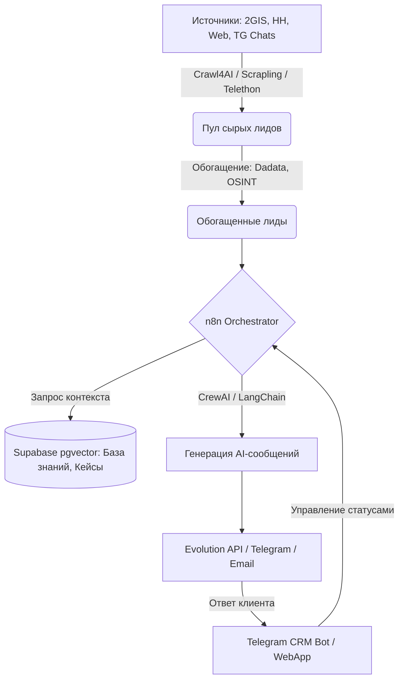

# Глубокое исследование: B2B Lead Generation, OSINT, RAG Outreach и Telegram CRM (СНГ и Global)

Этот документ представляет собой разбор open-source решений, архитектурных паттернов и подходов для создания системы B2B-лидогенерации, обогащения контактов и автоматизации продаж, с последующим масштабированием в SaaS. Исследование базируется на анализе GitHub, VC.ru, Habr, Reddit (r/sales, r/saas, r/n8n) и Hacker News.

---

## 1. Компоненты системы и Open-Source инструменты

### 1.1 Lead Discovery & Scraping (Поиск и сбор базы)
Вместо покупки готовых (и часто устаревших) баз, современный подход — "OSINT-first", базирующийся на публичных сигналах (вакансии, новости, открытые реестры).

*   **Crawl4AI**: Идеально подходит для LLM-пайплайнов. Отлично рендерит JS-сайты и конвертирует HTML в чистый Markdown/JSON. Имеет встроенные стратегии (`RegexExtractionStrategy`, `LLMExtractionStrategy`) для быстрого поиска контактов на корпоративных сайтах.
*   **Scrapling**: Python-фреймворк, устойчивый к антифрод-системам (например, Cloudflare Turnstile). Умеет адаптироваться к изменениям верстки сайтов ("самолечащиеся" селекторы). Используется как "таран" для доступа к защищенным каталогам.
*   **Специфика СНГ (HH, 2GIS, Карты)**:
    *   **2GIS / Яндекс Карты**: На GitHub популярны парсеры на базе Playwright/Puppeteer, собирающие номера телефонов и сайты компаний по рубрикам.
    *   **HH.ru**: Парсинг вакансий — мощный триггер. Если компания ищет маркетолога, ей можно продать маркетинговый SaaS. Используются кастомные Python-скрипты с ротацией прокси.

### 1.2 Contact Enrichment & OSINT (Обогащение и валидация)
Найденные компании нужно обогатить контактами ЛПР (Лиц, принимающих решения).

*   **Альтернативы Hunter.io / Apollo**: В open-source комьюнити популярны OSINT-инструменты, такие как `xurlfind3r` для разведки доменов, а также пайплайны на GitHub (напр., `50k-lead-generation-system`), объединяющие поиск в Google и парсинг LinkedIn.
*   **Telegram & Phone Resolvers**: 
    *   Существуют OSINT скрипты (например, PhoneInfoga, Maigret) для поиска цифрового следа по номеру телефона.
    *   Telegram username resolvers часто строятся на базе Telethon/Pyrogram для массовой проверки существования аккаунтов.
*   **Dadata / Adata (СНГ)**: Незаменимы для обогащения ИНН, проверки реквизитов и получения юридических email-адресов. Хоть API и платное, есть бесплатные лимиты, легко интегрируемые через Python/n8n.
*   **Email Verification**: Использование сервисов вроде ZeroBounce, Reacher или Mailcheck (есть open-source обертки) для снижения bounce rate при рассылках.

### 1.3 AI Outreach & Sequence Generation (Генерация RAG-цепочек)
Интеллектуальное ядро системы, заменяющее спам-рассылки персонализированными сообщениями ("Вайбкодинг" и "Таргетированный аутрич", популярные на Habr/VC).

*   **Оркестрация (n8n)**: Выступает в роли "позвоночника" (Control Plane). Собирает данные, обращается к базам и триггерит агентов. n8n стабильнее для B2B пайплайнов, чем чистый код.
*   **LangChain / RAG**: Векторные БД (Supabase pgvector, Qdrant) хранят информацию о компании-клиенте, кейсы и базу знаний продукта. При написании письма LangChain делает RAG-запрос: "Найди релевантный кейс для строительной компании".
*   **CrewAI (Мультиагентность)**: Используется для сложных задач:
    *   *Агент-Рисерчер*: Гуглит последние новости лида.
    *   *Агент-Копирайтер*: Пишет персонализированное письмо с учетом новостей и RAG.
    *   *Агент-Ревьюер*: Проверяет, не звучит ли письмо как ИИ-спам.

### 1.4 Messaging Channels & Dispatchers (Каналы доставки)
*   **WhatsApp**: **Evolution API** — абсолютный лидер open-source для WhatsApp. Позволяет работать через WhatsApp Web протокол без официального Business API (снижает косты на старте).
*   **Telegram**: 
    *   **Userbots (Telethon / Pyrogram)**: Для парсинга чатов, инвайтинга и первых касаний. В СНГ мониторинг профильных B2B-чатов и перехват лидов по ключевым словам ("посоветуйте подрядчика") дает конверсию 15-25% против 0.5% у спама (данные VC.ru/Habr).
    *   **Bot API (Aiogram / grammY)**: Для официального общения, CRM-интерфейсов и саппорта.
*   **Email**: SMTP скрипты, либо обертки над Resend/Novu для транзакционных писем.

### 1.5 Telegram CRM & SaaS Control Plane (Управление и монетизация)
*   **UI/UX**: Telegram WebApp (Mini Apps) в связке с Inline клавиатурами — идеальный интерфейс для CRM в кармане сейлза.
*   **Backend & Database**: **Supabase** (PostgreSQL) — стандарт de facto. Обеспечивает Row-Level Security (RLS) для мультитенантности (изоляции данных разных клиентов в SaaS). В связке с Edge Functions (Deno) и `pgvector` закрывает 90% бекенда.
*   **Биллинг**: Интеграция Telegram Payments, Stripe (для global) и Kaspi (для KZ/СНГ) через вебхуки в Supabase.

---

## 2. Готовая Архитектура и Стек

**Стек Технологий:**
*   **Инфраструктура**: Docker, VPS (Ubuntu).
*   **Парсинг**: Python, Crawl4AI, Scrapling, Playwright.
*   **Оркестрация & ИИ**: n8n, CrewAI, LangChain, OpenAI/Anthropic API.
*   **База Данных**: Supabase (PostgreSQL, pgvector).
*   **Рассылки**: Evolution API (WA), Telethon (TG).
*   **SaaS Backend/Frontend**: FastAPI (для тяжелого ML/парсинга), Next.js (для дашбордов) или Telegram WebApp (React).

**Схема Архитектуры:**

---

## 3. Модель перехода от Скрипта к SaaS

Превращение внутренних скриптов парсинга и рассылки в B2B SaaS продукт:

### Этап 1: "Для себя" (Internal Tool)
*   **Архитектура**: Локальные Python скрипты (Scrapling + Crawl4AI) пишут в CSV или Google Sheets. n8n работает на локальном Docker. 
*   **Рассылки**: Ручные или через локальный Evolution API/Telethon.
*   **Цель**: Обкатка промптов, получение первых лидов и денег для своей компании.

### Этап 2: Productization (Упаковка в Telegram CRM)
*   **Архитектура**: Перенос базы в Supabase. Настройка n8n webhook'ов. Создание Telegram бота (на aiogram или grammY), куда падают "теплые" лиды, ответившие на рассылку.
*   **Функционал**: Менеджер может отвечать клиенту прямо из Telegram-бота, двигать по воронке (Inline кнопки "Квалифицирован", "Отказ").

### Этап 3: B2B SaaS (Multitenancy)
*   **Архитектура**: Внедрение Row-Level Security в Supabase для разделения рабочих пространств клиентов. 
*   **Интерфейс**: Next.js дашборд или Telegram WebApp для клиентов, где они загружают свои промпты, базы знаний (для RAG) и подключают свои аккаунты WhatsApp/Telegram.
*   **Монетизация**: Stripe / Telegram Payments. Клиент платит за подписку (доступ к CRM) + Pay-as-you-go за токены LLM и лиды.
*   **Технический нюанс**: Вместо того чтобы гонять тяжелые парсеры для каждого клиента, SaaS агрегирует парсинг на бекенде, а клиентам продает доступ к "потоку готовых теплых лидов", отфильтрованных ИИ под их нишу.

---
**Ключевые инсайты:**
Массовый спам в Telegram/WA умирает. Фокус сместился на **intent-based outreach** (аутрич на основе намерений), где ИИ мониторит чаты и изменения на сайтах (например, найм новых сотрудников), и пишет точечно в нужный момент. Использование Crawl4AI + Supabase + n8n — самый быстрый способ собрать такую систему без изобретения велосипеда.
