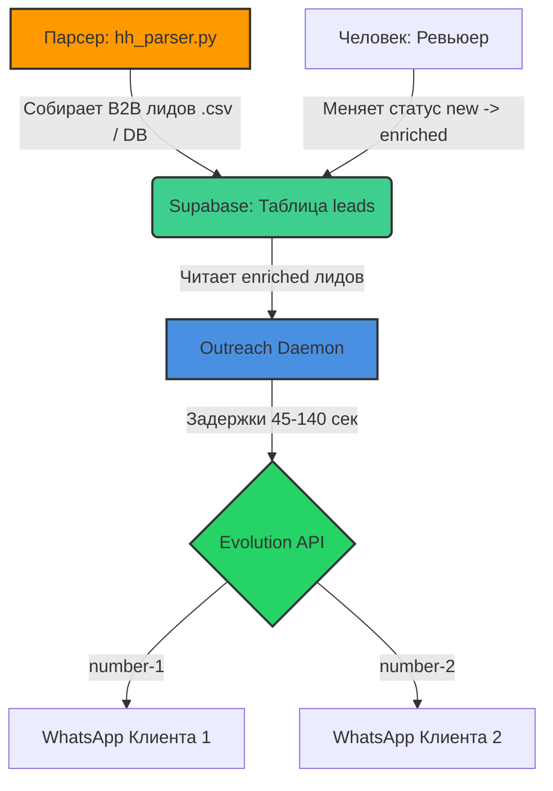

# 📘 Руководство по LeadGen Системе (Сбор и Рассылка)

Это руководство объясняет, как управлять связкой "Парсер HH.ru + База Supabase + Автоматический Рассыльщик WhatsApp".

---

## 🏗 Краткая архитектура (Как это работает)



1. **`hh_parser.py`** собирает B2B-компании с открытыми вакансиями и складывает их в CSV. (В будущем мы подключим его напрямую в базу).
2. Вы отсматриваете эти базы и закидываете целевых лидов в **Supabase** со статусом `enriched`.
3. Умный демон **`outreach_daemon.py`** работает на сервере 24/7, берет лидов со статусом `enriched` и плавно отправляет им WhatsApp-сообщения.

---

## 1️⃣ Настройка и запуск Парсера (`hh_parser.py`)

Файл парсера находится по пути: `06_Scripts_and_Tools/hh_parser/hh_parser.py`.

### 📌 Что можно менять:
Откройте файл в редакторе (VS Code) и прокрутите в самый низ. Там есть блок **НАСТРОЙКИ ПАРСЕРА**:
* `CITY_CODE` — укажите цифровой код города (например, 1220 для ЕКБ).
* `SEARCH_QUERY` — запрос (кого ищет компания). Пишите логикой ИЛИ: `"Руководитель отдела продаж OR Менеджер по логистике"`.
* `PAGES_TO_PARSE` — сколько страниц собирать (1 страница = 100 вакансий).

### ⚠️ Ограничения и Лимиты (HH.ru):
* **Блокировки без ключа:** Официально HH.ru отдает базу через API только зарегистрированным приложениям. Без приложения вас может выкинуть с ошибкой `403 Forbidden`. (Нужно будет зарегистрироваться на `dev.hh.ru` и вставить токен, если такое случится).
* **Глубина поиска:** HH.ru API отдает не более **2000** вакансий на один запрос.
* **Защита:** В коде уже стоит `time.sleep(1)` между страницами, чтобы не словить бан по IP.

### 🚀 Как запустить:
В терминале напишите:
`python3 06_Scripts_and_Tools/hh_parser/hh_parser.py`
Результат сохранится в файл `hh_leads.csv`.

---

## 2️⃣ Подключение Базы Данных (Supabase .env)

Все скрипты зависят от файла `.env` в корне проекта.
Там обязательно должны лежать правильные полные ключи:

```env
SUPABASE_URL="https://[ВАШ_ПРОЕКТ].supabase.co"
SUPABASE_KEY="КЛЮЧ_SERVICE_ROLE"
```
**Важно:** Ключ `SUPABASE_KEY` должен быть секретным **service_role** ключом (из скрытого раздела API в настройках Supabase), иначе парсеры не смогут записывать новые данные из-за защиты RLS!

---

## 3️⃣ Запуск Авто-Рассыльщика (`outreach_daemon.py`)

Этот скрипт отправляет WhatsApp-сообщения через Evolution API. Файл: `06_Scripts_and_Tools/outreach_daemon.py`.

### 📌 Что нужно поменять (Внутри кода):
Откройте скрипт и замените названия ваших номеров в Evolution API:
`INSTANCES_POOL = ["instance_1", "instance_2", "instance_3"]`
Если у вас только один подключенный номер WhatsApp, оставьте один:
`INSTANCES_POOL = ["instance_1"]`

### ⚠️ Ограничения и Анти-Бан (WhatsApp):
* **Очередь:** Скрипт забирает за раз по 5 лидов. (Переменная `BATCH_SIZE = 5`).
* **Паузы:** После каждого отправленного сообщения скрипт ждет от **45 до 140 секунд**. Это критическая защита от спам-фильтров WhatsApp!
* **Имитация ввода:** Человек 3 секунды "печатает" сообщение перед тем как оно появляется у клиента.

### 🚀 Как запустить Навсегда (на VPS):
Чтобы скрипт не умер, когда вы закроете крышку макбука, его нужно запускать через `tmux` на сервере:

1. Создайте сессию: `tmux new-session -s sender`
2. Запустите скрипт: `python3 06_Scripts_and_Tools/outreach_daemon.py`
3. Сверните сессию: нажмите <kbd>Ctrl+B</kbd>, затем клавишу <kbd>D</kbd>.
*Все, скрипт будет работать месяцами.* Чтобы вернуться в окно и посмотреть логи: `tmux attach-session -t sender`.
