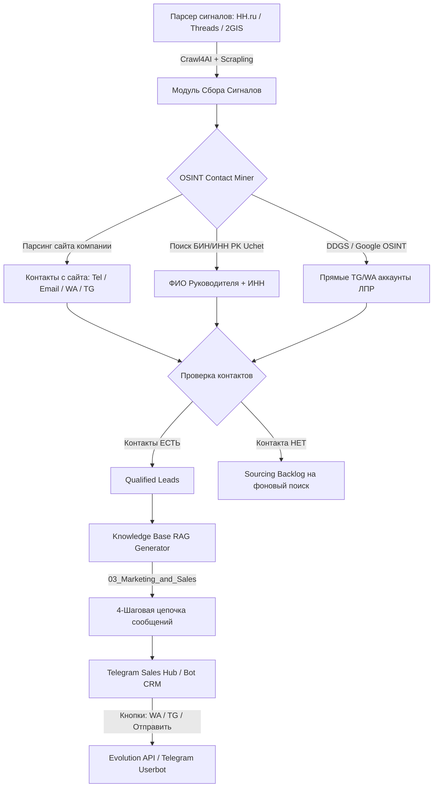

# План реализации: LeadGen OS (Для себя → SaaS)

Полный план создания автономной системы сбора лидов с **100% гарантией наличия контактов**, OSINT-обогащением, 4-шаговыми RAG-цепочками по вашей Базе Знаний и карманной ТГ-CRM.

---

## 1. Бесплатные инструменты в стеке

* `Crawl4AI` / `Scrapling` — парсинг сайтов компаний, обход блокировок (Free Open-Source).
* `Evolution API` — WhatsApp рассылки без платы за Meta API (Free self-hosted в Docker на VPS).
* `Telethon` / `Aiogram 3` — Telegram Userbot для сбора контактов и Bot API для CRM (Free Open-Source).
* `Supabase` (PostgreSQL + pgvector + RLS) — векторная база знаний и CRM-склад (Free Tier / Docker на VPS).
* `n8n` — вебхуки и оркестрация (установлен на VPS).
* `PK Uchet` скрапер / DuckDuckGo OSINT — 100% бесплатно.
* `Dadata` — 10 000 бесплатных проверок организаций в день.
* `Vertex AI` (`vertex_sa.json`) — модель генерации без дополнительных расходов.

---

## 2. Архитектура системы

---

## 3. Фазы реализации (Roadmap)

### Фаза 1: Сбор и 100% Обогащение Контактов (`daily_leadgen.py` & `lpr_enricher.py`)
- Разбить выдачу на `qualified_leads.json` (только с контактами) и `backlog.json`.
- Интегрировать каскадный `OSINT Contact Miner`:
  1. Извлечение сайта компании и парсинг `Contact` страниц через `Crawl4AI` / `httpx`.
  2. Запрос в `PK Uchet` по БИН/Названию компании для извлечения ФИО директора.
  3. Поисковый запрос через DuckDuckGo: `"{Компания}" ("директор" OR "отдел продаж") site:t.me OR "+7"`.

### Фаза 2: AI RAG Generator по Базе Знаний (`kb_outreach_architect.py`)
- Подключить материалы из `03_Marketing_and_Sales/` (кейсы, автоворонки, офферы).
- Сформировать генератор 4-этапной цепочки касаний:
  - **Hook:** Упоминание боли из вакансии/поста.
  - **Value Pitch:** Кейс с метриками из БЗ.
  - **Interactive Demo:** Описание ИИ-агента под их нишу.
  - **Call to Action:** Легкий следующий шаг.

### Фаза 3: Telegram Sales Hub CRM (`telegram_agent_bot.py`)
- Обновить интерфейс ТГ-бота:
  - Меню `/leads` показывает карточки **только квалифицированных лидов С КОНТАКТАМИ**.
  - Интерактивные кнопки под карточкой: `[📲 Написать в WhatsApp]`, `[✈️ Написать в TG]`, `[📜 Посмотреть цепочку]`, `[Редактировать]`.
  - Кнопка `[Статус: Отправлено / Переговоры / Отказ]`.

### Фаза 4: Подготовка фундамента под SaaS (Multitenant Supabase + Evolution API)
- Перенос структуры хранения из логов в Supabase (PostgreSQL).
- Подключение `Evolution API` на VPS для автоотправки в WhatsApp.
