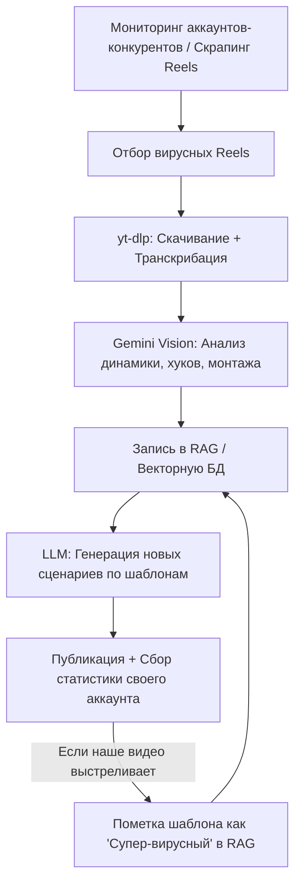

# Самообучающаяся контент-машина для Reels/Shorts

На основе исследования форумов (Reddit, n8n Community, GitHub) была собрана архитектура для построения полностью автоматической самообучающейся контент-машины.

## 🚀 Архитектурная схема (Growth Loop)

Система работает по принципу замкнутого цикла (Feedback Loop):

---

## 🛠 Готовые решения и шаблоны с форумов

Мы нашли несколько отличных бесплатных наработок, которые можно взять за основу:

1. **Решение против "пейволлов" (Reddit n8n Community):**
   * **Стек:** n8n + Apify (Instagram Scraper) + OpenAI/Gemini + Pinecone (Vector DB) + Google Sheets.
   * **Принцип:** n8n раз в день запускает скрапер Apify для целевых аккаунтов (например, `rooma.project`). Забирает Reels с аномально высокими просмотрами (например, просмотры > 3x от среднего по аккаунту). Скачивает видео, транскрибирует аудио, просит LLM разложить ролик по структуре и отправляет в векторную базу данных.

2. **n8n Workflow Template 12045 ("Transform viral Instagram Reels into original scripts"):**
   * **Стек:** Apify + Perplexity AI + OpenAI.
   * **Суть:** Берет вирусный Reel, анализирует контекст через Perplexity (для обогащения фактами) и собирает сценарий для нового оригинального видео на ту же тему, сохраняя структуру оригинала.

3. **n8n Workflow Template 6729 ("Transform Instagram reels into viral content"):**
   * **Стек:** Mistral AI + AssemblyAI (транскрибация) + Google Sheets.
   * **Суть:** Позволяет быстро перерабатывать чужие Reels в текстовые посты, карусели или новые сценарии.

---

## 📈 Пошаговый план внедрения (Cost-Effective & Revenue-Generating)

### Шаг 1: Автоматический парсинг (Scraping)
* Настраиваем **Apify Instagram Reels Scraper** (стоит копейки, есть бесплатный лимит). Он собирает метаданные: просмотры, лайки, текст поста, ссылки на видео файлы.
* Запускаем через n8n раз в неделю для пула из 10-15 топ-аккаунтов в вашей нише (дизайн, визуализация, ИИ-агенты).

### Шаг 2: Извлечение структуры (Deconstruction)
* Передаем видео-ссылку напрямую в **Gemini 2.5 Flash API** (у нее гигантский контекст и она нативно «видит» видео, что экономит деньги на сторонней транскрибации).
* Промпт для Gemini вытаскивает:
  1. **Хук (0-3 сек):** Визуальный ряд + текст на экране.
  2. **Монтажная динамика:** Длина кадров (динамичный монтаж или длинные эстетичные планы).
  3. **Сюжетная линия:** Проблема -> Решение -> Результат -> Call to Action.
  4. **ASMR/Звуки:** Наличие звуков переключения, фоновой музыки.

### Шаг 3: Векторная база знаний (RAG)
* Сохраняем полученные структуры в базу данных (Supabase pgvector или простой Notion/Airtable).
* Каждому шаблону присваивается рейтинг виральности (Views / Followers).

### Шаг 4: Генератор сценариев
* При создании нового ролика под ваш продукт (например, ИИ-ассистент продаж), мы пишем тему.
* Система ищет в RAG-базе топ-3 шаблона с лучшей динамикой из вашей ниши.
* Генерирует готовый сценарий с раскадровкой (что показывать на экране, какой текст писать, какой голос накладывать).

---

## 📝 Зачем это нужно бизнесу?
Это напрямую генерирует дешевые лиды. Вместо гипотез вы копируете структуры, которые алгоритмы Instagram уже оценили и продвинули в рекомендации.
