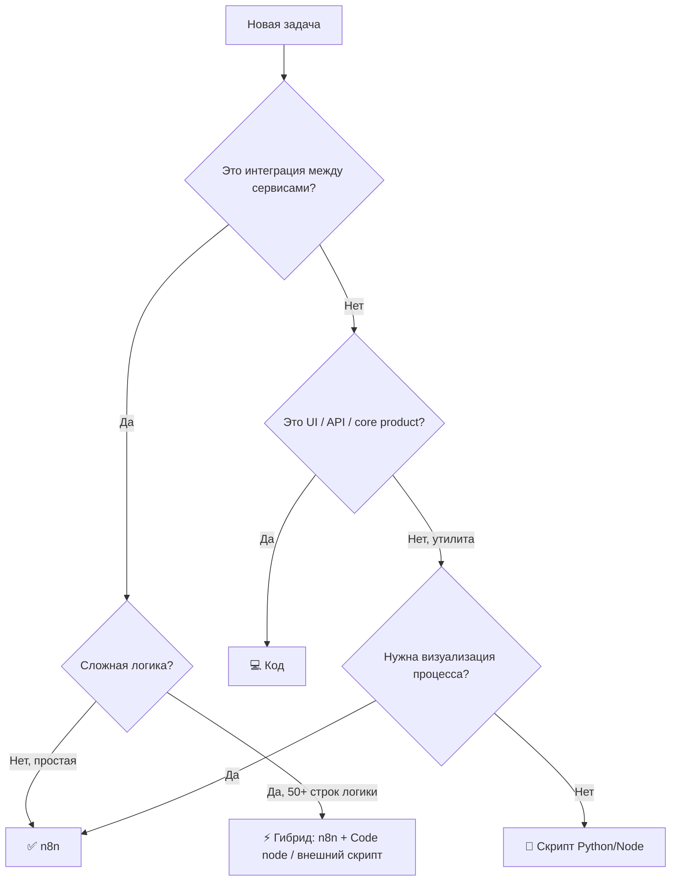
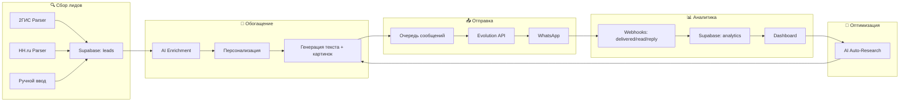

# 🧠 Стратегия: AI-агенты + Outreach-система + Монетизация

> Дата: 15.04.2026 | Статус: Требует утверждения

---

## TL;DR — Что делаем

1. **Настраиваем рабочее окружение** (комп + телефон) для быстрой разработки с ИИ
2. **Строим WhatsApp Outreach Pipeline** (парсинг → обогащение → рассылка → трекинг)
3. **Решаем n8n vs код** — гибрид с чёткими границами
4. **Запускаем B2B лидген** для продажи своих решений
5. **Определяем**: делать SaaS или локальный скрипт для себя

---

## 1. Настройка AI-агентного рабочего процесса

### 🖥️ С компа (основной режим)

| Инструмент | Для чего | Когда |
|:---|:---|:---|
| **Antigravity (Gemini)** | Стратегия, архитектура, сложный код, n8n workflows, дебаг | Планирование, сложные задачи |
| **Cline (VS Code)** | Быстрые правки, UI, рефакторинг файлов | Итеративная разработка |
| **n8n UI** | Визуальные автоматизации, интеграции, webhook-цепочки | Связка сервисов, простая логика |

### 📱 С телефона (мобильный режим)

```
Телефон → SSH (Blink/Termius) → VPS → tmux → Cline CLI
```

**Конкретный сетап:**
1. **VPS** — твой сервер (151.241.100.226), уже есть
2. **tmux** — чтобы сессия жила даже когда телефон спит
3. **SSH-клиент**: 
   - iOS: **Blink Shell** (лучший) или **Moshi** (заточен под ИИ-агентов, пуш-уведомления)
   - Android: **Termius** или **Termux**
4. **Cline CLI** установить на VPS: `npm install -g @anthropic/cline`
5. **tasks.md** — вместо набора длинных промптов, пиши задачи в файл, агент читает

> [!TIP]
> **Для быстрой работы с телефона**: создай `tasks.md` в проекте, пиши туда задачи. Подключайся по SSH, запускай `tmux`, потом `cline --task "выполни задачи из tasks.md"`. Агент работает — ты занимаешься другими делами.

### ⚡ Что замедляет разработку с ИИ (и как исправить)

| Проблема | Решение |
|:---|:---|
| **Нет чёткого ТЗ** | Перед стартом: 1 абзац "что делаем", 3-5 пунктов "что должно получиться" |
| **Прыгаешь между задачами** | Один проект → один фокус → один результат. Потом следующий |
| **Не фиксируешь прогресс** | `PROGRESS.md` + git commit после каждого блока |
| **Не тестируешь** | После каждого блока — запуск, скриншот, проверка |
| **Слишком большие задачи** | Разбивай на 15-30 мин чанки. "Сделай парсер" → плохо. "Сделай парсер категории X, верни JSON с полями name,phone,address" → хорошо |
| **Переделываешь одно и то же** | Делай `.clinerules` / системные промпты с правилами проекта |
| **Нет архитектуры** | 30 мин на схему ПЕРЕД кодом экономит 5 часов переделки |

> [!IMPORTANT]  
> **Правило "1-5 часов на SaaS"**: Реально только если у тебя готовые шаблоны + чёткое ТЗ + один конкретный сценарий. Иначе — 1-2 недели на MVP. Не обманывай себя нереальными сроками.

---

## 2. n8n vs Код vs Гибрид — Когда что

### Матрица решений



### Конкретно для твоих задач:

| Задача | n8n | Код | Почему |
|:---|:---:|:---:|:---|
| Парсинг 2ГИС/HH | ❌ | ✅ | Нужен Playwright/Selenium, обход защит — n8n не справится |
| Обогащение лидов (AI) | ✅ | ❌ | HTTP Request + AI Node — идеально для n8n |
| Генерация текстов/персонализация | ✅ | ❌ | AI Agent node в n8n |
| Отправка WhatsApp | ✅ | ❌ | Evolution API webhook — n8n нативно |
| Трекинг/аналитика дашборд | ❌ | ✅ | Нужен UI, графики — веб-приложение |
| CRM / канбан статусов | ⚡ | ⚡ | Supabase + простой веб-UI или n8n Data Tables для MVP |
| Цепочки follow-up | ✅ | ❌ | Scheduler + условия — стандартная задача n8n |
| SaaS платформа | ❌ | ✅ | Нужен auth, billing, multi-tenant — только код |

### Логирование и дебаг

**В n8n:**
- Логи запусков есть в UI → Executions
- Webhook `messages.upsert` от Evolution API → ловить в n8n и писать в Supabase
- Sticky Notes на каждый блок workflow — что делает, как настроить

**В коде:**
- `console.log` → файл через `winston` или `pino`
- Структурированные логи: `{ timestamp, action, status, data }`
- Отправка критических ошибок в Telegram через бот

---

## 3. WhatsApp Outreach Pipeline — Архитектура

### Общая схема



### Этап 1: Парсинг лидов (КОД — Python)

#### Для логистики (2ГИС)

> [!WARNING]
> Парсинг 2ГИС без согласия нарушает ToS. Официальный путь: API 2ГИС (dev.2gis.ru) или покупка данных (data.2gis.com). Неофициальный путь — на свой риск.

**Легальные альтернативы:**
- **API 2ГИС** — зарегать приложение на dev.2gis.ru, получить ключ
- **data.2gis.com** — купить выгрузку по категория + городам
- **Google Maps API** — Places API, тоже есть телефоны

**Структура данных на выходе:**
```json
{
  "company_name": "ТК Деловые Линии",
  "phone": "+7...",
  "address": "...",
  "category": "Логистика / Грузоперевозки",
  "city": "Алматы",
  "website": "...",
  "source": "2gis",
  "parsed_at": "2026-04-15"
}
```

#### Для B2B продаж (HH.ru)

**Официальный API HH.ru** (dev.hh.ru):
- Регистрируешь приложение → OAuth → получаешь доступ
- Endpoint: `GET /vacancies?text={ключевое слово}&area={город}`
- Из вакансии: название компании, город, контакты (ограниченно)
- Employer endpoint: `GET /employers/{id}` → сайт, описание

**Стратегия B2B лидгена через HH:**
1. Ищем вакансии "маркетолог" / "руководитель отдела продаж" / "IT директор" в средних компаниях
2. Компания ищет маркетолога → значит, у них проблема с маркетингом → наш оффер в тему
3. Из вакансии достаём: название, сайт, размер компании
4. Через сайт/LinkedIn находим ЛПР
5. Отправляем персонализированное сообщение

### Этап 2: Обогащение (n8n workflow)

```
Trigger (новый лид в Supabase) 
  → HTTP Request (Tavily AI / Perplexity — поиск информации о компании)
  → AI Agent (анализ: боли, интересы, размер компании)
  → Update Supabase (добавить enrichment данные)
  → Генерация первого сообщения (персонализация по Nick Saraev стратегии)
```

**Поля обогащения:**
- `company_description` — чем занимается
- `company_size` — малый/средний/крупный
- `pain_points` — предполагаемые боли (AI анализ)
- `personal_hook` — персональный крючок для первого сообщения
- `ai_score` — скоринг 1-10 (насколько подходит)

### Этап 3: Коммуникационные цепочки (n8n)

**Цепочка для логистики:**

| День | Сообщение | Тип |
|:---|:---|:---|
| 0 | Первый контакт: персональный hook + вопрос | Текст |
| +1 | Если нет ответа: полезный контент (инфографика о рынке) | Картинка + текст |
| +3 | Follow-up: кейс похожей компании | Текст |
| +7 | Последний: "если не актуально — просто напишите" | Текст |

> [!CAUTION]
> **Анти-бан правила (Evolution API / неофициальный WA):**
> - Новый номер: 3-5 сообщений/день первые 3 дня, потом +5/день
> - Старый номер: MAX 50 уникальных контактов/день
> - Пауза между сообщениями: 30-120 секунд (рандом)
> - Уникальный текст каждому (Spintax или AI генерация)
> - При первом disconnect → СТОП, смена номера
> - Ротация номеров: 3-5 номеров в пуле

### Этап 4: Аналитика и трекинг

**Supabase таблицы:**

```sql
-- Лиды
CREATE TABLE leads (
  id UUID PRIMARY KEY,
  company_name TEXT,
  phone TEXT,
  source TEXT, -- '2gis', 'hh', 'manual'
  category TEXT,
  enrichment JSONB,
  ai_score INTEGER,
  status TEXT DEFAULT 'new', -- new, contacted, replied, qualified, dead
  created_at TIMESTAMPTZ DEFAULT now()
);

-- Сообщения  
CREATE TABLE messages (
  id UUID PRIMARY KEY,
  lead_id UUID REFERENCES leads(id),
  direction TEXT, -- 'outbound', 'inbound'
  content TEXT,
  message_type TEXT, -- 'text', 'image', 'document'
  wa_status TEXT, -- 'sent', 'delivered', 'read', 'replied'
  sent_at TIMESTAMPTZ,
  delivered_at TIMESTAMPTZ,
  read_at TIMESTAMPTZ
);

-- Кампании
CREATE TABLE campaigns (
  id UUID PRIMARY KEY,
  name TEXT,
  target_niche TEXT,
  template_chain JSONB, -- цепочка шаблонов
  total_sent INTEGER DEFAULT 0,
  total_delivered INTEGER DEFAULT 0,
  total_read INTEGER DEFAULT 0,
  total_replied INTEGER DEFAULT 0,
  started_at TIMESTAMPTZ,
  status TEXT DEFAULT 'draft'
);
```

**Dashboard (веб-приложение):**
- Воронка: отправлено → доставлено → прочитано → ответили
- Конверсия по кампаниям
- Лучшие шаблоны по отклику
- Канбан-доска статусов лидов

### Этап 5: AI Auto-Research (n8n)

```
Schedule (раз в неделю)
  → Supabase: получить статистику кампаний
  → AI Agent: "проанализируй конверсии, предложи улучшения"
  → Результат → Telegram уведомление
  → Опционально: автоматическая корректировка шаблонов
```

---

## 4. B2B продажи своих решений

### Целевая аудитория
- **Средние компании** (50-500 сотрудников)
- **Ниши**: логистика, недвижимость, автосалоны, медицина, образование
- **ЛПР**: CEO, CMO, директор по продажам

### Оффер
> "Автоматизируем привлечение клиентов через WhatsApp: от поиска лидов до первого контакта. Без спама, с персонализацией через ИИ. Пилот — бесплатно на 50 контактов."

### Ценообразование (ориентир)
| Пакет | Что входит | Цена |
|:---|:---|:---|
| **Пилот** | 50 лидов + рассылка + отчёт | Бесплатно |
| **Старт** | 500 лидов/мес + AI персонализация + аналитика | 50-100K тг/мес |
| **Бизнес** | 2000 лидов/мес + цепочки + CRM + дашборд | 200-400K тг/мес |
| **Под ключ** | Всё + настройка + сопровождение | от 500K тг разово |

---

## 5. SaaS vs Локальный скрипт — Решение

### Сравнение

| | Локальный скрипт | SaaS платформа |
|:---|:---|:---|
| **Время на MVP** | 1-2 недели | 2-3 месяца |
| **Стоимость** | ~0 (только VPS) | Разработка + инфра + поддержка |
| **Доход** | Услуги (ты делаешь руками) | Подписка (масштабируется) |
| **Риск** | Низкий | Средний |
| **Масштаб** | 1-10 клиентов | 100+ клиентов |

> [!IMPORTANT]
> **Рекомендация: Начни с локального скрипта / услуги**
> 
> 1. Сделай работающий pipeline для СЕБЯ
> 2. Продай как услугу 3-5 клиентам, подтверди спрос
> 3. Если спрос есть → делай SaaS (multi-tenant, auth, billing)
> 4. Не строй SaaS "в стол" — это путь к потере времени и денег

---

## 6. Приоритизированный план действий

### 🔴 Неделя 1 — Фундамент (ДЕНЬГИ)

- [ ] Настроить SSH + tmux на VPS для мобильной работы
- [ ] Создать Supabase таблицы (leads, messages, campaigns)
- [ ] Написать парсер 2ГИС/HH.ru (Python, 1-2 категории для теста)
- [ ] Настроить n8n workflow: обогащение + генерация сообщений

### 🟡 Неделя 2 — Рассылка

- [ ] n8n workflow: очередь отправки через Evolution API
- [ ] Цепочка из 3-4 сообщений с задержками
- [ ] Webhook для трекинга (delivered/read/reply → Supabase)
- [ ] Тестовый запуск на 20-30 контактов

### 🟢 Неделя 3 — Аналитика + B2B

- [ ] Простой дашборд (HTML + JS + Supabase API)
- [ ] AI auto-research workflow (еженедельный анализ)
- [ ] Начать B2B лидген через HH.ru для продажи своих услуг
- [ ] Отправить 5-10 предложений потенциальным клиентам

### 🔵 Неделя 4+ — Масштабирование

- [ ] Ротация номеров (3-5 в пуле)
- [ ] Канбан-доска статусов лидов
- [ ] Решение о SaaS (по результатам первых продаж)

---

## Open Questions

> [!IMPORTANT]
> **Вопросы на которые нужен твой ответ перед стартом:**

1. **Логистика — какой город/регион?** Алматы? Вся РК? РФ?
2. **Номера WhatsApp** — сколько у тебя есть прогретых номеров для рассылки?
3. **Evolution API** — инстанс работает стабильно? Сколько номеров подключено?
4. **Бюджет на данные** — готов платить за официальный API 2ГИС/HH или только бесплатные методы?
5. **B2B оффер** — что именно продаём? "AI-автоматизация маркетинга"? "WhatsApp аутрич"? "AI-агенты для бизнеса"? Нужно сформулировать 1 чёткое предложение.
6. **Первый приоритет** — начинаем с логистики (2ГИС) или B2B продаж (HH.ru)?

---

## Verification Plan

### Автоматические тесты
- Парсер: проверка на 10 записях из тестовой категории
- n8n workflow: тестовый запуск с mock данными
- Supabase: проверка RLS и запись/чтение

### Ручная верификация
- Отправка 5 тестовых сообщений на свои номера
- Проверка трекинга (delivered/read статусы приходят)
- Визуальная проверка дашборда

