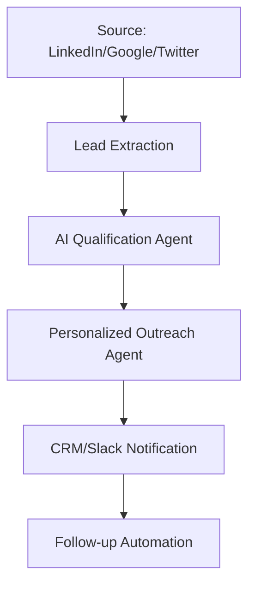

# AI Lead Generation Agent Pipeline

This document explains how to build an automated AI Agent system for finding, qualifying, and reaching out to potential clients (LeadGen).

## 1. The LeadGen Workflow

---

## 2. Step-by-Step Breakdown

### Step A: Lead Sourcing
- **What it does**: Scrapes or pulls data from platforms where your target audience hangs out.
- **Tools**: Apollo.io, PhantomBuster, or custom scrapers (using Apify).
- **Automation**: A trigger that runs daily to find "New Hires" or "Recent Funding" (high-intent signals).

### Step B: AI Qualification Agent
- **What it does**: An AI agent reads the lead's website or LinkedIn profile to see if they fit your "Ideal Customer Profile" (ICP).
- **Tools**: OpenAI (GPT-4o), Perplexity API (for real-time web search).
- **Logic**: "Does this company have more than 10 employees? Do they use AI in their product?"

### Step C: Personalized Outreach
- **What it does**: Generates a unique message based on a specific detail found in Step B (e.g., a recent blog post they wrote).
- **Tools**: OpenAI, Claude, or specialized tools like Instantly.ai / Lemlist.
- **Template**: "Hey [Name], I saw your recent post about [Topic] and thought..."

### Step D: Delivery & CRM
- **What it does**: Sends the email/DM and logs the lead in your CRM.
- **Tools**: HubSpot, Pipedrive, or a simple Google Sheet.

---

## 3. How to Verify if it's Working

1.  **Extraction Rate**: Are you getting at least 50-100 leads per day?
2.  **Qualification Accuracy**: Is the AI correctly identifying "Good" vs "Bad" leads? (Test with 10 manual checks).
3.  **Response Rate**: Are people actually replying? (Target: >5% for cold outreach).

## 4. Implementation Strategy

Use **n8n** with the **AI Agent Node**. This allows the agent to use "Tools" (like searching Google or reading a website) before making a decision.
