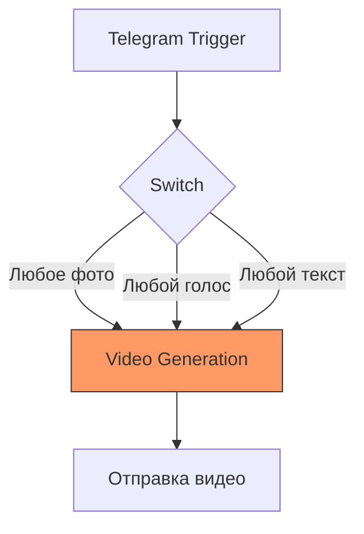
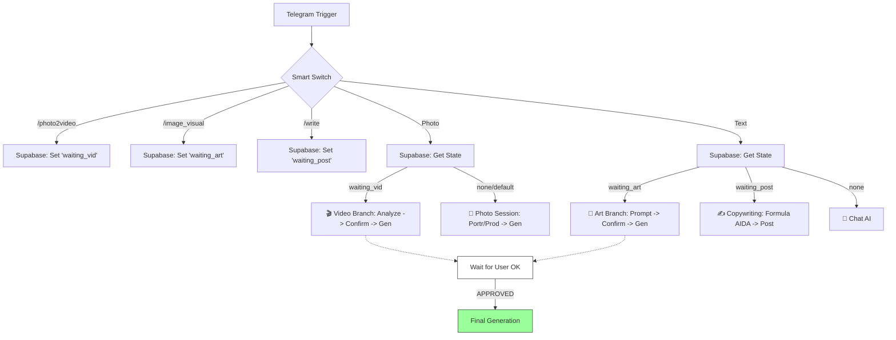

# Архитектура MediaFactory v2.0 (Target)

Этот документ описывает структуру обновленного бота с поддержкой состояний (states) и умным распределением команд.

## Сравнение Схем

### ТЕКУЩАЯ СХЕМА (V1.0) - Хаос
Сейчас бот реагирует на любой ввод (фото/голос) одинаково, сразу запуская генерацию видео. Это приводит к лишним тратам API и путанице.

### ЦЕЛЕВАЯ СХЕМА (V2.0 PRO) - Порядок
Здесь мы вводим **Supabase** как хранилище текущего режима пользователя. Бот "помнит", что вы только что нажали команду `/image2video` и ждет конкретно фото для видео.

## Ключевые изменения (v2.0):
1. **Prompt Lab**: Интерактивное подтверждение промпта кнопками (Да/Нет) перед запуском API.
2. **Копирайтинг**: Бот помогает писать посты по формуле AIDA через команду `/write`.
3. **Состояния**: Бот понимает контекст (зачем вы прислали фото).
4. **Imagen 3**: Переход на самую стабильную модель генерации для России и СНГ.
