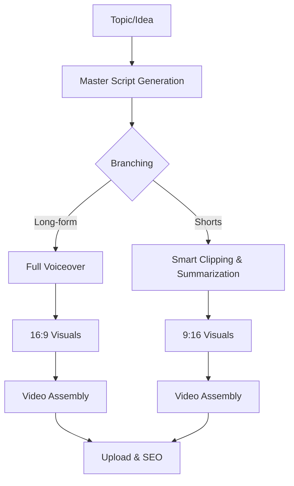

# YouTube Automation Pipeline: A to Z Guide

This document explains the full lifecycle of a faceless YouTube automation project, from the initial idea to the final upload.

## 1. The Pipeline Overview (Longs & Shorts Branching)

The automation pipeline can now branch into two formats: **Long-form (16:9)** and **Shorts (9:16)**.

---

## 2. Step-by-Step Breakdown

### Step A: Topic & Research
- **What it does**: Identifies trending topics or keywords in your niche.
- **Tools**: Google Trends, VidIQ, TubeBuddy, or AI (ChatGPT/Claude).
- **Automation**: A scheduled trigger (e.g., every Monday) that pulls top news from an RSS feed or Twitter.

### Step B: Script Generation (using `templates.json`)
- **What it does**: Converts the topic into a structured script with a Hook, Intro, Body, and Outro.
- **Tools**: OpenAI API (GPT-4), Claude API.
- **Verification**: Check if the script length matches your target video duration (e.g., 150 words per minute).

### Step C: Voiceover (TTS)
- **What it does**: Converts the text script into a high-quality human-like voice.
- **Tools**: ElevenLabs (best quality), Google Cloud TTS, OpenAI TTS.
- **Verification**: Listen for correct pronunciation of technical terms or names.

### Step D: Visuals & Assets
- **What it does**: Finds relevant stock footage, images, or generates AI images (Midjourney/DALL-E) to match the script.
- **Tools**: Pexels API, Storyblocks, Canva, or Leonardo.ai.
- **Automation**: Using keywords from the script to search for matching clips.

### Step E: Video Assembly (The "Factory")
- **What it does**: Combines the voiceover, background music, and visuals into a single MP4 file.
- **Tools**: Shotstack (API-based), Remotion (React-based), or Adobe Premiere (manual).
- **Verification**: Ensure the background music isn't too loud compared to the voice.

### Step F: Metadata & SEO
- **What it does**: Generates a catchy title, description, and tags to help the video rank.
- **Tools**: OpenAI (using the Metadata Template in `templates.json`).
- **Verification**: Check if the title is under 70 characters for better mobile visibility.

### Step G: Upload & Schedule
- **What it does**: Uploads the video to YouTube as "Private" or "Unlisted" for a final manual check.
- **Tools**: YouTube Data API v3.

---

## 3. How to Verify if it's Working

To know if your pipeline is "functional" (рабочий), check these three things:

1.  **Data Flow**: Does the script from Step B actually reach the TTS engine in Step C?
2.  **Asset Matching**: Do the visuals in Step D actually relate to what the voice is saying?
3.  **Rendering Success**: Does the final MP4 file play correctly without glitches?

## 4. Implementation Strategy

Start with **n8n** or **Make.com**. These tools allow you to "glue" these APIs together without writing complex code. Use the `templates.json` file to provide the "brain" (AI) with the exact structure it needs to follow.
